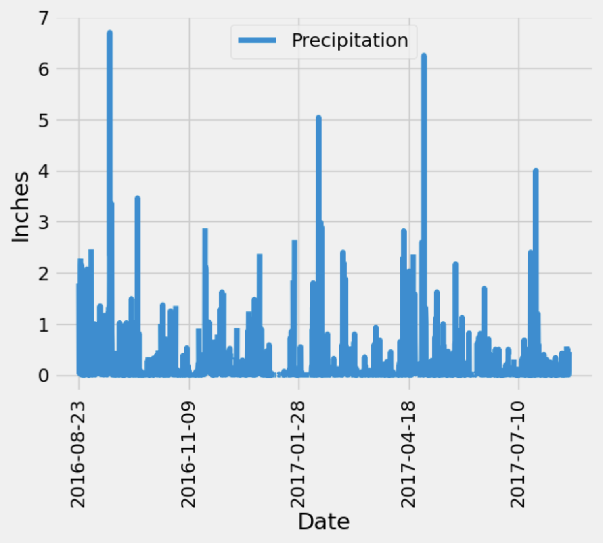
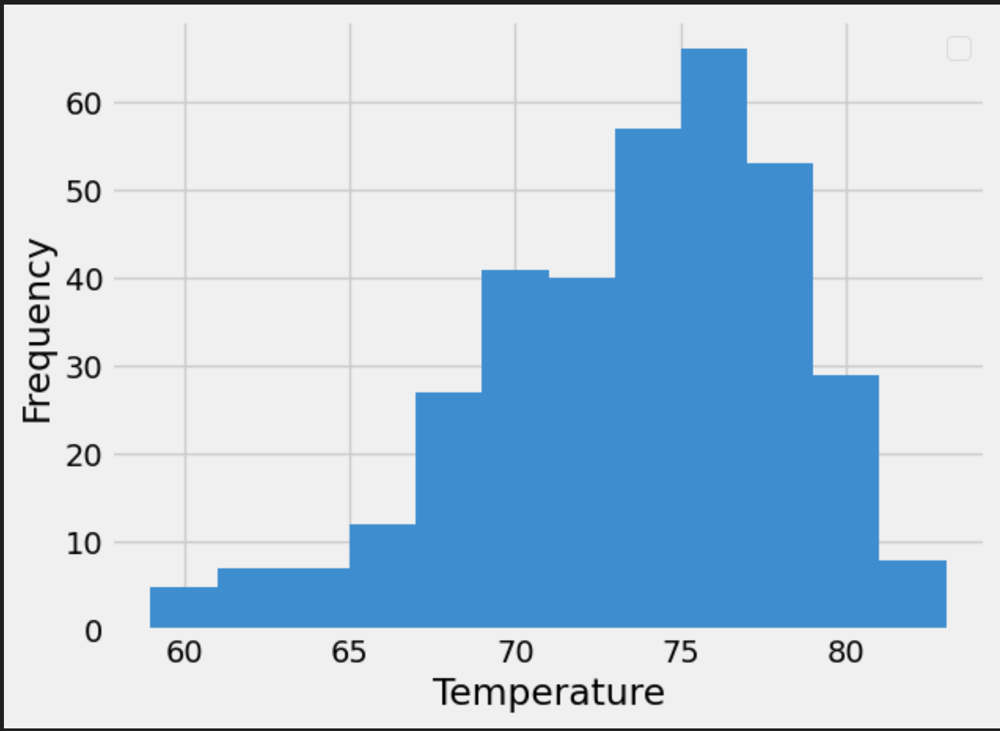

# SQlAlchemy Challenge

The goal of this project aimed to gain familiarity with SQLAlchemy using a dataset of observed temperatures and precipitations from various stations in Hawaii. The first part of the project used SQLAlchemy to query the SQLite database while the second part resulted in a simple API with various endpoints.

After the database was reflected into objects, the most recent year of precipitation data were plotted using the pandas library. 

The station that had the most observations was USC00519281. A histrogram for its prior year of observed temperatures follows:

The second part of the project combined the use of the ORM by way of SQLAlchemy to build an API application. A summary of the available endpoints is below:

Available API endpoints:
  /api/v1.0/: This is the base URL  
  /api/v1.0/precipitation: Returns JSON of the precipitation observed and corresponding dates for the prior year 
  /api/v1.0/stations: Returns JSON of Hawaii stations that appear in the dataset 
  /api/v1.0/tobs: Returns JSON of prior year's observed temperatures and corresponding dates at the most active station, USC00519281 
  /api/v1.0/start/<start_date>: takes a date as input and returns a JSON of the minimum, maximum, and average observed temperatures that occurred after the date of input 
  /api/v1.0/dates/<start_date>/<end_date> : takes a start and end date as input and returns a JSON of the minimum, maximum, and average observed temperatures that occurred between the start and end dates 
